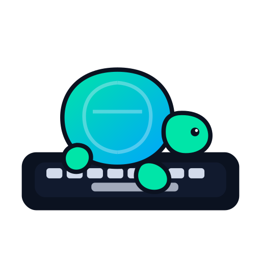

<div align="center">



# LENUK TYPE

**Type like a builder. Move like a machine.**

A MonkeyType-inspired typing arena for Timor-Leste — bilingual, dark-mode first, with a live ranked leaderboard.

<p>
  
  
  
  
  
  
</p>

<p>
  <a href="https://lenuktype.fun"><b>Live App</b></a> &nbsp;·&nbsp;
  <a href="https://lenuktype.fun/leaderboard"><b>Leaderboard</b></a> &nbsp;·&nbsp;
  <a href="https://lenuktype.fun/stats"><b>My Stats</b></a>
</p>

</div>

---

## Live Leaderboard

Three-winner podium on studio pillars — gold, silver, bronze trophies with metallic rank numerals and a pulsing champion glow. Country flags, WPM, accuracy and personal-best badges under every name.

<div align="center">
  <a href="https://lenuktype.fun/leaderboard">
    
  </a>
  <br /><br />
  <sub><b>Live screenshot</b> — <a href="https://lenuktype.fun/leaderboard"><code>lenuktype.fun/leaderboard</code></a></sub>
</div>

**On the board**

- Top-3 podium with custom SVG trophy cups and country flags
- Full standings with filters (duration, difficulty, language)
- Search by name · live sort by score · tie-breakers on accuracy → WPM → date
- Mobile-first cards, desktop table layout
- Auto-refresh and focus re-fetch

```text
+------+----------------+-----+----------+------------+------+-------+
| Rank | Player         | WPM | Accuracy | Difficulty | Mode | Score |
+------+----------------+-----+----------+------------+------+-------+
| 1    | John Doe       | 82.5| 99.6%    | hard       | text | 95.4  |
| 2    | Anna           | 64.1| 100.0%   | medium     | text | 69.2  |
| 3    | Lary           | 63.1| 100.0%   | easy       | text | 63.1  |
+------+----------------+-----+----------+------------+------+-------+
```

---

## What's Inside

### Typing arena
- **Smooth animated caret** — one `<span>` tweens across characters via `getBoundingClientRect`, not per-char re-renders
- **MonkeyType-style coloring** — typed-correct bright, errors red, future dim
- **Live HUD** — WPM · Raw · Accuracy · Errors · Timer · Streak (fixed-width slots so numbers don't shift)
- **Live WPM sparkline** during a run
- **Post-run hero result** — 7xl WPM in brand color + full WPM chart with gradient fill and grid lines
- **CapsLock warning** banner with pulsing chrome
- **Tab = restart** · **Enter = new text** keyboard shortcuts
- **Swipe-to-restart** on mobile
- **Ghost race** against your personal best with semi-transparent caret
- Settings panel auto-hides while typing to keep focus on the text

### Stats dashboard (`/stats`)
- All-time best hero banner with pulsing emerald glow
- Metric tiles: runs, avg speed, accuracy, time typed, streak, consistency
- **GitHub-style activity heatmap** (year in weeks × 7 days)
- **WPM keystroke heatmap** from your best run — where you sped up, where you stalled
- Recent-pace bar chart with peak highlighted in emerald
- Best-by-duration cards with PB badges (15s / 30s / 60s)
- Recent runs table with hover tint and PB highlighting
- Export to JSON · reset local stats

### Leaderboard (`/leaderboard`)
- Trophy-cup podium with metallic SVG gradients
- Rank numerals in `bg-clip-text` (1, 2, 3)
- Diagonal light-ray backdrop
- Filters, search, skeleton loading, live updates

### Auth & identity
- Anonymous-first: start typing immediately, profile name + country saved locally
- **Magic-link upgrade** via Supabase Auth to sync across devices
- Runtime-injected public config (never compiled into the JS bundle)

### Internationalization
- **English + Tetun** (Timor-Leste) fully translated
- Typing prompts pulled from per-language word lists
- Language switcher in the HUD

---

## Design System

The palette is pulled from the [app icon](public/icon.svg) — a turtle on a keyboard — and carried through every surface in both themes.

| Role | Token | Value |
|---|---|---|
| Primary · caret | `--caret` / `--primary` | `#00E5A8` emerald |
| Secondary | `--secondary` | `#00A3FF` blue |
| Background (dark) | `--background` | `#0B1220` navy |
| Card (dark) | `--card` | `#111A2E` deep navy |
| Foreground (dark) | `--foreground` | `#E7F0FF` off-white |
| Error | `--error` | red |

Everything — caret, pill toggles, progress bar, leaderboard CTA, stat highlights, PB badges — ties back to the emerald brand.

**Typography**

- Body: **Inter** (variable, weights 400–800)
- Typing prompt + numerics: **Roboto Mono** with ligatures disabled for per-character precision

---

## Ranking Algorithm

Score is derived client-side from each run:

```ts
score = wpm * clamp(accuracy / 100, 0.75, 1.03) * difficultyWeight
```

| Difficulty | Weight |
|---|---|
| easy   | 1.00 |
| medium | 1.08 |
| hard   | 1.16 |

**Tie-breakers:** higher accuracy → higher WPM → harder difficulty → more recent run.

---

## Tech Stack

- **Next.js 15** (App Router, RSC, dynamic routes)
- **React 19**
- **TypeScript** (strict)
- **Tailwind CSS 3** with CSS variable theming
- **Supabase** — Postgres + REST fallback, Auth (magic link)
- **i18next** — English + Tetun
- **Playwright** — E2E tests
- **Vitest** — unit tests
- **Plausible** — privacy-friendly analytics (optional, env-gated)
- Vercel-ready deployment

---

## API Routes

| Method | Path | Purpose |
|---|---|---|
| `POST` | `/api/results` | Validate + store a typing run |
| `GET`  | `/api/results` | Normalized leaderboard data |
| `GET`  | `/api/results/debug` | Diagnostics + optional write probe (`?probeWrite=1`) |
| `GET`  | `/og` | Dynamic Open Graph share image for run results |

---

## Local Setup

```bash
npm install
npm run dev
```

App runs at `http://localhost:3000`.

**Production build**

```bash
npm run build
npm start
```

---

## Environment Variables

Create `.env.local` with the values you use. **Note:** no `NEXT_PUBLIC_` prefixes — public config is injected at runtime via `window.__LENUK_CONFIG__` so values never end up in the compiled client bundle.

```bash
# Supabase project URL (reaches the browser at runtime, not build time)
SUPABASE_URL=

# Publishable / anon key (at least one)
SUPABASE_PUBLISHABLE_KEY=
# or
SUPABASE_ANON_KEY=

# Server-only key (recommended for API routes)
SUPABASE_SERVICE_ROLE_KEY=

# Optional: direct Postgres (server tries pg first, then REST fallback)
SUPABASE_DB_URL=
# or
DATABASE_URL=

# Optional: table + cache tuning
SUPABASE_RESULTS_TABLE=lenuk_typing_users
SUPABASE_RESULTS_CACHE_TTL_MS=0
SUPABASE_PG_RETRY_COOLDOWN_MS=120000

# Optional: Plausible analytics domain (script only loads when set)
PLAUSIBLE_DOMAIN=
```

**Behavior notes**

- If `SUPABASE_DB_URL` is unreachable, the API transparently falls back to Supabase REST.
- `SUPABASE_PG_RETRY_COOLDOWN_MS` debounces retries during temporary DNS / network failures.
- Renaming config from `NEXT_PUBLIC_` prefixes to bare names means rotating Supabase keys is a runtime restart, not a rebuild.

---

## NPM Scripts

| Script | What it does |
|---|---|
| `npm run dev` | Start the dev server |
| `npm run build` | Production build |
| `npm run start` | Run the production server |
| `npm run lint` | Lint checks |
| `npm run typecheck` | Route typegen + TypeScript no-emit |
| `npm run test:unit` | Unit tests (Vitest) |
| `npm run test:e2e` | End-to-end tests (Playwright) |

---

## Project Layout

```text
app/
  page.tsx                  → Typing surface (home)
  leaderboard/page.tsx      → Podium + standings
  stats/page.tsx            → Personal dashboard
  api/results/route.ts      → POST + GET runs
  api/results/debug/route.ts
  og/route.tsx              → Dynamic OG image
  layout.tsx                → Root, runtime config injection, fonts
components/
  typing/                   → Surface, prompt, stats, guides
  stats/                    → Dashboard, WPM heatmap
  ui/                       → Buttons, pickers, toggles, tooltip
  providers/                → i18n provider
hooks/
  use-typing-engine.ts      → Keystroke capture → metrics
  use-auth.ts               → Supabase session + magic link
  use-swipe-to-restart.ts   → Mobile gesture handler
lib/
  engine/typing-engine.ts   → Pure engine (framework-free)
  supabase.ts               → Browser + server clients
  supabase-results.ts       → REST + pg fallback
  public-config.ts          → Runtime config injection
  user-stats.ts             → Local-first run history
src/content/                → Word lists + test generator per language
```

---

## Testing

**Unit** — Vitest covers the engine, scoring, and helpers.

```bash
npm run test:unit
```

**E2E** — Playwright covers typing flow, leaderboard rendering, and auth gate on Chromium + Mobile Chrome.

```bash
npm run test:e2e
```

The Playwright config auto-starts the dev server.

---

## Roadmap

- [x] Core typing engine (keystroke capture, WPM / raw / accuracy / streak)
- [x] Smooth animated caret + MonkeyType-style character coloring
- [x] Live leaderboard podium with trophy cups
- [x] Frontend score ranking (speed × accuracy × difficulty)
- [x] Supabase REST fallback when Postgres is unreachable
- [x] Bilingual: English + Tetun
- [x] Personal stats dashboard with activity heatmap + best-by-duration
- [x] Dynamic Open Graph share cards
- [x] Magic-link auth to sync across devices
- [x] Plausible analytics (runtime-injected)
- [x] Error boundary + splash screen
- [x] Playwright E2E suite
- [x] Ghost race against your personal best
- [x] Brand palette lifted from the app icon (emerald + navy)
- [ ] Daily / weekly challenge events
- [ ] More practice packs (code, bilingual, long-form)
- [ ] Public player profiles
- [ ] Replay viewer for your top runs

---

## Vision

A typing tool that feels like a serious dev product:

- clear architecture
- fast runtime
- competitive feedback loop
- polished UI with real-time data
- built for Timor-Leste, open to the world

<div align="center">

Made by [Julião Martins](https://github.com/juliao-martins-dev) · Timor-Leste 🇹🇱

</div>
